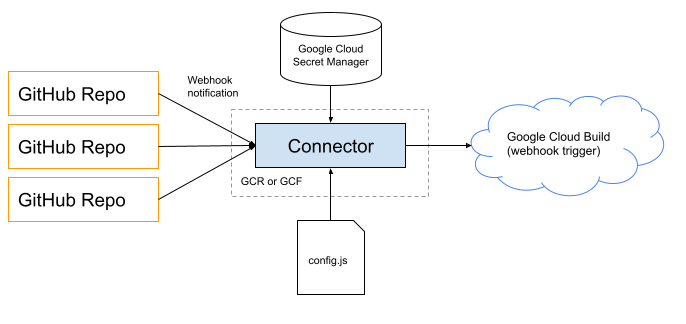

# Overview

Initiate Google Cloud Build (GCB), builds from Github Webhooks (GHW).  The Github webhook will POST to Google Cloud Run (GCR) endpoint, verify action to perform, then execute GCB build.  Think of this as a filter service for GitHub messages, filtering to specific (if any) GCB actions.

The `config.js` file in this repository will be responsible for setting up which repositories, with which actions, should preform which builds.




# Adding a trigger

Add a trigger is a three step process:
 - Create a GitHub webhook on your repository that posts to this service
 - Update this service with the proper hook configuration, mapping GitHub webhook message events to Google Cloud Build Triggers
 - Create a Google Cloud Build - Webhook Trigger to preform the action

# Create Github Webhooks

The main webhooks we will focus on are:
  - https://docs.github.com/en/developers/webhooks-and-events/webhook-events-and-payloads#pull_request
  - https://docs.github.com/en/developers/webhooks-and-events/webhook-events-and-payloads#push

But any Github repository webhook POST payload can (should) be processed.

Documentation on setting up github webhooks:
https://docs.github.com/en/developers/webhooks-and-events/creating-webhooks

Make sure you set:
  - Payload url: url to google cloud run service (see) Google Cloud Run console
  - Content type: `application/json`
  - the secret as the github secret stored in the Google Cloud Secret Manager (default: github-webhook-github-secret)

Access the (default) Github webhook secret via gcloud

```bash
gcloud secrets versions access latest --secret=github-webhook-github-secret
```

# Adding hook to config.js

The following is an example structure for registering GitHub repositories with a
specified Google Cloud Build trigger based on filtering the (JSON) message payload.

```javascript
{
  hooks : {
    // name of google cloud build trigger
    'rp-sandbox-webhook' : {
      // github message filter
      filters : [{
        '$event' : 'pull_request',
        action : 'closed',
        pull_request : {
          merged : true,
          base : {
            ref : 'sandbox'
          }
        }
      }],
      // repositories that should trigger build
      repositories : [
        'ucd-library/rp-ucd-client',
        'ucd-library/vessel',
        'ucd-library/rp-ucd-harvest'
      ]
    }
  }
}
```

 - The `hooks` keys are the name of the Google Cloud Build triggers.
 - The `fitler` object must match all provied key/value pairs in the provided Github message, including nested/child objects. In this example:
   - The `X-GitHub-Event` header is of type `pull_request` (see more below on `$event`) 
   - the `action` must be set to `closed`
   - there must exist a `pull_request` object
   - the `pull_request.merged` property must be set to `true`
   - the `pull_request.base.ref` property must be `sandbox`.  (This is the branch being merged to)
 - The `repositories` array contains the repository names, one of which must be set as the GitHub messages `repository.full_name` property. 

 Two special bits:
  - `$event` is added to the message payload which is the value of `X-GitHub-Event` header (name of event that sent the message)
  - If you just want to know if a property exists, you set the filter property to `$exists`.  Will evalutate to `true` as long as the message payload property exists.

 # Adding Google Cloud Build - Webook Trigger

Docs: https://cloud.google.com/build/docs/automating-builds/create-webhook-triggers

Make sure you set the trigger secret as the secret stored in the Google Cloud Secret Manager (default: github-webhook-gcb-secret).  Note, these secrets are versioned and the UI does not allow you to select `latest`, so it is recommended to select the largest number and note that updating the GCB secret means updating the webhook triggers AND redeploying this repository.

The API key should already be in the secret Manager
